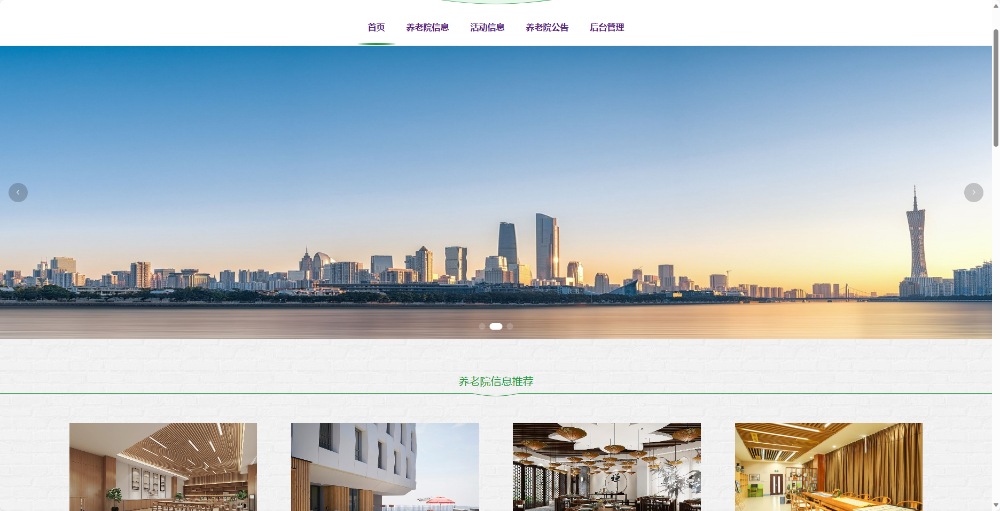
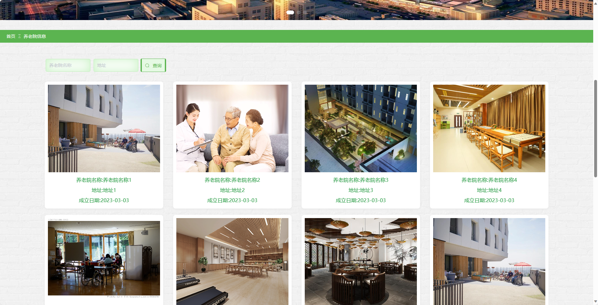
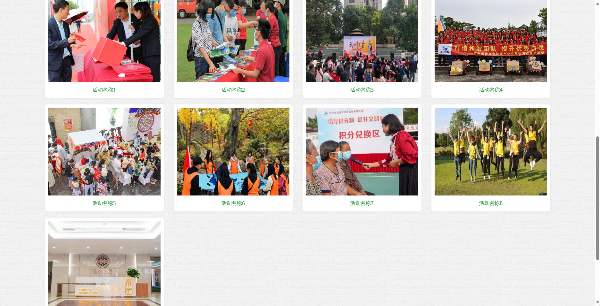
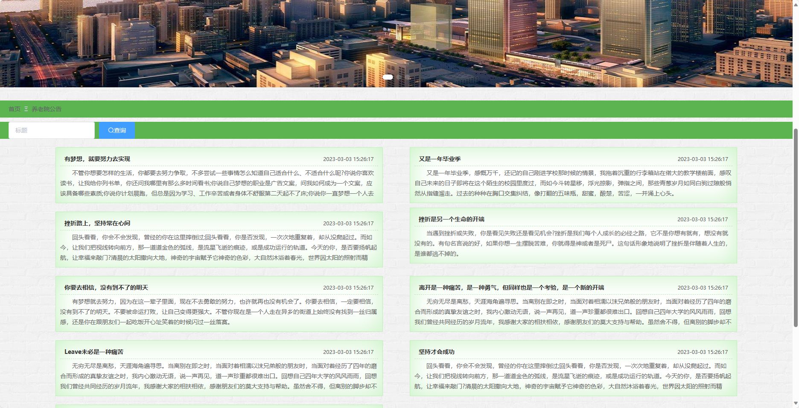
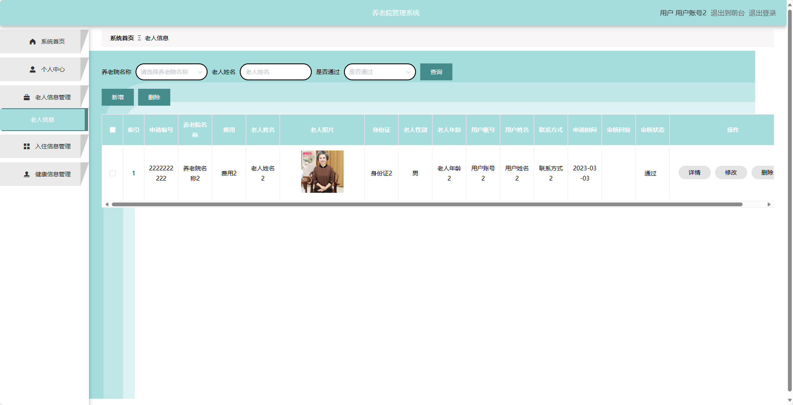
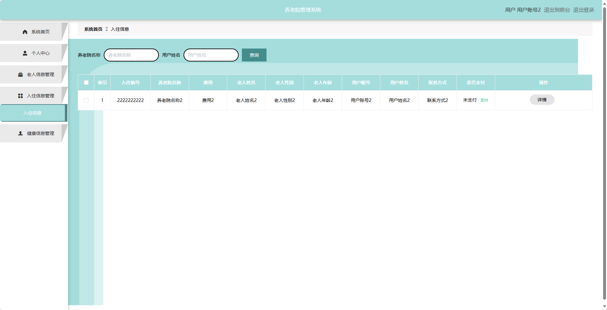
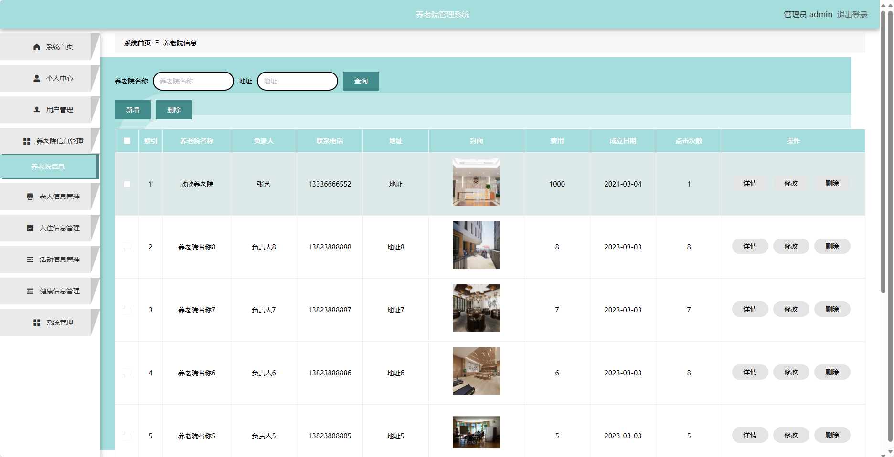
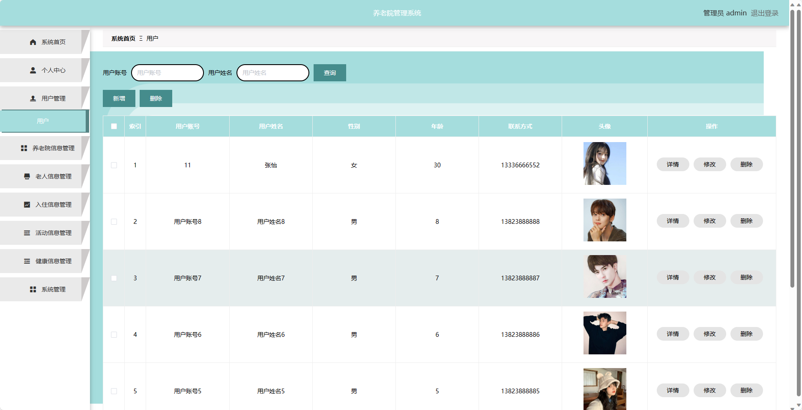
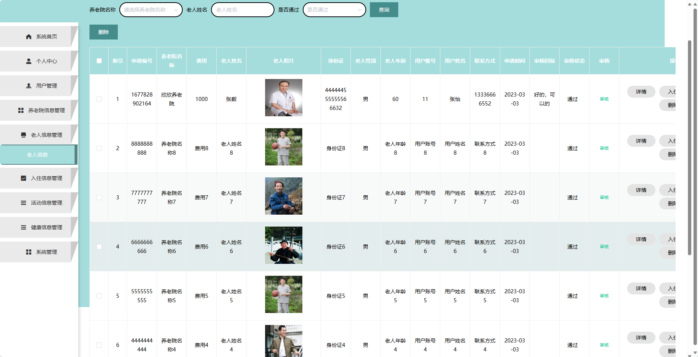
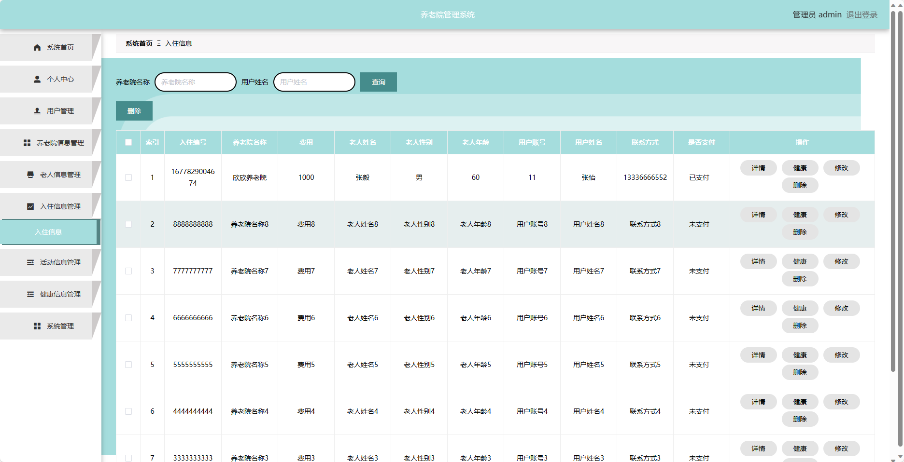

基于SpringBoot的养老院管理系统（程序+论文）
=
- 完整代码获取地址：从戎源码网 ([https://armycodes.com/](https://armycodes.com/))
- 作者微信：19941326836  QQ：952045282 
- 承接计算机毕业设计、Java毕业设计、Python毕业设计、深度学习、机器学习
- 选题+开题报告+任务书+程序定制+安装调试+论文+答辩ppt 一条龙服务
- 所有选题地址https://github.com/nature924/allProject

一、项目介绍
---
基于Spring Boot框架实现的养老院管理系统，系统包含两种角色：管理员、用户,系统分为前台和后台两大模块，主要功能如下。

### 前台：
- 首页：展示养老院的概述信息、推荐活动等内容。
- 养老院信息：用户可以查看养老院的详细信息。
- 活动信息：用户可以查看养老院的活动信息。
- 养老院公告：用户可以获取最新的养老院相关公告信息。
- 个人中心：用户可以管理个人信息、查看老人信息、入住信息和健康信息。

### 后台：
### 管理员角色：
- 个人中心：管理员可以管理个人信息，修改密码等。
- 用户管理：管理员可以管理用户的信息，包括添加、编辑和删除用户信息。
- 养老院信息管理：管理员可以管理养老院的信息，包括添加、编辑和删除养老院信息。
- 老人信息管理：管理员可以管理老人的信息，包括添加、编辑和删除老人信息。
- 入住信息管理：管理员可以管理老人的入住信息，包括添加、编辑和删除入住信息。
- 活动信息管理：管理员可以管理养老院的活动信息，包括添加、编辑和删除活动信息。
- 健康信息管理：管理员可以管理老人的健康信息，包括添加、编辑和删除健康信息。
- 系统管理：管理员可以设置系统的基本信息，包括养老院名称、联系方式等。

### 用户角色：
- 个人中心：用户可以管理个人信息，修改密码等。
- 老人信息管理：用户可以管理自己的老人信息，包括添加、编辑和删除老人信息。
- 入住信息管理：用户可以管理自己老人的入住信息，包括添加、编辑和删除入住信息。
- 健康信息管理：用户可以管理自己老人的健康信息，包括添加、编辑和删除健康信息。

二、项目技术
---
- 编程语言：Java
- 数据库：MySQL
- 项目管理工具：Maven
- 前端技术：VUE、HTML、Jquery、Bootstrap
- 后端技术：Spring、SpringMVC、MyBatis

三、运行环境
---
- 操作系统：Windows、macOS都可以
- JDK版本：JDK1.8以上都可以
- 开发工具：IDEA、Ecplise、Myecplise都可以
- 数据库: MySQL5.7以上都可以
- Tomcat：任意版本都可以
- Maven：任意版本都可以

四、运行截图
---
### 论文截图：

### 程序截图：

